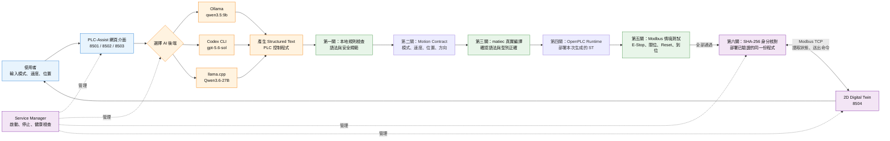

# PLC-Assist 目前架構圖

## 一張圖看懂系統

## 架構分成四層

| 層級 | 功能 | 簡單說法 |
|---|---|---|
| 操作層 | Streamlit 網頁、控制參數 | 使用者在這裡下需求、查看結果 |
| AI 生成層 | Ollama、Codex、llama.cpp | 將自然語言轉成 PLC Structured Text |
| 驗證層 | Validator、matiec、情境測試 | 依序確認「規則合理、編得過、跑得對」 |
| 執行與展示層 | OpenPLC、Modbus、2D Twin | 執行已驗證程式，並以動畫操作與觀察虛擬軸 |

## 主要服務與網址

| 服務 | 網址 | 用途 |
|---|---|---|
| Ollama 本地版 | `http://localhost:8501` | 快速產生 ST 程式 |
| Codex 推理版 | `http://localhost:8502` | 產生並自動修復編譯問題 |
| llama.cpp MTP 版 | `http://localhost:8503` | 使用本機 Qwen3.6-27B 模型 |
| 2D Digital Twin | `http://localhost:8504` | 操作及觀察 OpenPLC 虛擬軸 |
| OpenPLC Web | `http://localhost:8081` | 部署及管理 PLC Runtime |
| llama.cpp API | `http://localhost:8082` | 提供本機模型推論服務 |
| Modbus TCP | `localhost:502` | Twin 與 OpenPLC 交換控制命令和軸狀態 |

## 一分鐘口頭報告稿

這套系統叫 PLC-Assist，主要目的是協助使用者把自然語言需求轉換成 PLC 的 Structured Text 程式。

首先，使用者在網頁輸入運行模式、速度和位置，接著可以選擇 Ollama、Codex 或 llama.cpp 作為 AI 後端來產生程式。

程式產生後不會直接執行，而是依序通過本地規則、Motion Contract、matiec 真實編譯、OpenPLC Runtime 與 Modbus 情境測試，最後再以 SHA-256 核對部署身分。

只有全部測試通過，程式才能持續部署到 OpenPLC Runtime。最後，2D Digital Twin 透過 Modbus 讀取軸的位置、速度和錯誤狀態，也能送出啟動、停止、復歸及新定位命令。

簡單來說，整體流程就是：**AI 幫忙寫程式，多層驗證負責把關，OpenPLC 負責執行，2D Twin 負責操作與展示。**

## 報告時可強調的三個重點

1. **支援三種 AI 後端**：可依速度、品質與本機資源彈性選擇。
2. **生成後有六道部署閘門**：不把 AI 產生的程式直接交給 PLC 執行。
3. **驗證與展示是同一份程式**：2D Twin 操作的是實際部署到 OpenPLC 的本次 ST 程式，不是固定示範程式。

> 安全提醒：目前的 E-Stop 與限位測試屬於軟體模擬，實機仍必須配置獨立的硬體安全迴路。
