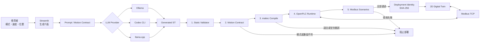

# PLC-Assist

PLC-Assist 是一套面向 IEC 61131-3 Structured Text（ST）的本機 AI 輔助開發與驗證平台。使用者從網頁輸入 JOG 或 Absolute Position 運動需求，系統生成 ST，經過靜態分析、matiec 真實編譯、OpenPLC／Modbus Runtime 情境測試後，才允許部署到 2D Digital Twin。

> 核心理念：LLM 負責產生草稿，編譯器與 Runtime 測試負責建立可信邊界。生成成功不等於可部署。

## 文件入口

- [本機展示重建指南](DEMO_REPRODUCTION.md)：從 GitHub clone 到完整展示與驗收。
- [Repository 與交付資料清單](REPOSITORY_MANIFEST.md)：哪些資料在 Git、哪些需外部取得。
- [完整部署說明](DEPLOYMENT.md)：OpenPLC、matiec、服務設定與疑難排解。
- [目前架構圖](PLC-Assist_目前架構圖.md)：系統元件、服務與資料流。
- [版本說明](RELEASE_NOTES.md)：目前發行版本與驗證紀錄。

## 架構說明

PLC-Assist 解決三個問題：

1. **生成**：把速度、位置、方向與復歸需求轉換成可讀的 ST 程式。
2. **驗證**：確認 ST 不只格式合理，還能真實編譯，且運動模式與 UI 要求一致。
3. **展示與操作**：把通過測試的同一份程式部署到 OpenPLC，再透過 2D Twin 觀察與控制虛擬軸。

目前支援：

- JOG：以 `MC_MoveVelocity` 持續正向或反向運動。
- Absolute Position：以 `MC_MoveAbsolute` 移動至指定位置。
- `MC_Power`、`MC_Reset`、E-Stop、正負限位與錯誤狀態驗證。
- Absolute Position 部署後互動修改位置與速度，不必重新生成 ST。
- Ollama、Codex CLI、llama.cpp 三種生成後端。

## 系統架構



資料流的重點是：Twin 部署的不是固定展示程式，而是本次生成、編譯並完成 Runtime 驗證的同一份 ST。系統會用 SHA-256 核對程式身分，避免重新生成後誤用上一份結果。

## 應用層與元件責任

| 層級 | 職責 | 主要元件 |
|---|---|---|
| 操作介面層 | 收集控制需求、顯示生成與驗證結果 | `app.py`、`app_codex.py`、`app_llamacpp.py` |
| AI Provider 層 | 串接本機或 CLI 模型並解析輸出 | `codex_provider.py`、`local_provider.py` |
| Prompt 契約層 | 鎖定 UI 模式、速度、位置與方向，避免 Prompt 與 UI 衝突 | `prompt_contract.py` |
| 靜態驗證層 | 快速檢查 POU、變數、禁用語法與安全規則 | `validator.py` |
| 運動契約層 | 比對 `MC_MoveAbsolute`／`MC_MoveVelocity` 與 UI 需求 | `motion_contract.py` |
| 編譯整合層 | 合併運動控制 stub、注入 Modbus adapter、呼叫 matiec | `compiler.py`、`motion_stubs/` |
| Runtime 驗證層 | 部署 OpenPLC 並執行啟用、E-Stop、限位、Reset 與到位測試 | `simulator.py`、`scenarios.py` |
| Twin 應用層 | 顯示虛擬軸、送出控制命令、保存顯示與軟限位設定 | `twin_app.py`、`twin_client.py`、`twin_settings.py` |
| 部署管理層 | 保存部署身分並管理 OpenPLC Runtime 生命週期 | `twin_deployment.py` |
| 服務管理層 | 統一啟停模型、UI、OpenPLC 與 Twin | `service_manager.py` |

### 四個應用介面

| 介面 | 預設網址 | 用途 |
|---|---|---|
| Ollama 本地版 | `http://localhost:8501` | 輕量、本機快速生成，預設 `qwen3.5:9b` |
| Codex 推理版 | `http://localhost:8502` | Codex CLI 生成、真實編譯與自動修復 |
| llama.cpp MTP 版 | `http://localhost:8503` | Qwen3.6-27B 本機高品質生成與 MTP 實驗 |
| 2D Digital Twin | `http://localhost:8504` | 操作與觀察已驗證的 OpenPLC 虛擬軸 |

Codex 介面只顯示安全的推理摘要、進度與 token 用量，不顯示或偽造模型私有的逐字思考鏈。若 matiec 編譯失敗，Codex 版最多會把真實錯誤交回模型修復兩輪。

## 驗證與部署閘門

ST 必須依序通過以下關卡：

1. **Local Validation**：規則式靜態分析，快速找出明顯錯誤。
2. **Motion Request Contract**：驗證 UI 與 ST 的模式、Position、Velocity 及 JOG 方向。
3. **matiec Compile**：捕捉 regex 無法辨識的真實語法與型別問題。
4. **OpenPLC Runtime**：部署本次生成的 ST，而非預製參考程式。
5. **Modbus Scenarios**：依 JOG／Absolute 模式測試啟用、停止、E-Stop、限位、Reset、方向切換或到位。
6. **Twin Deployment**：只有所有 Runtime 情境成功，部署按鈕才會啟用。

例如 UI 要求 Absolute Position，但模型產生 `MC_MoveVelocity`，系統會回報 `MOTION_MODE_MISMATCH`，並在進入 Runtime 前阻止部署。

## 快速開始

### 1. 建立 Python 環境

```powershell
python -m venv venv
.\venv\Scripts\python.exe -m pip install -r requirements.txt
```

### 2. 使用 Service Manager（建議）

```powershell
.\venv\Scripts\python.exe service_manager.py
```

Service Manager 可選擇快速本機、Codex、27B 高品質或全部測試組合，並管理服務的啟動、停止、健康狀態、網頁與日誌。它只會停止自己啟動的 PID，外部程序只會標示為 `external`。

日常使用建議一次只啟動一個生成後端。Qwen3.6-27B 使用最多 RAM／共享 GPU 記憶體；OpenPLC 只在 Compile + Simulate 或 Twin 操作時需要。

### 3. 單獨啟動介面

Ollama：

```powershell
ollama pull qwen3.5:9b
.\venv\Scripts\python.exe -m streamlit run app.py
```

Codex CLI（需先登入）：

```powershell
codex login
.\venv\Scripts\python.exe -m streamlit run app_codex.py --server.port 8502
```

llama.cpp／Qwen3.6-27B：

```powershell
.\setup\start_llamacpp.ps1
.\venv\Scripts\python.exe -m streamlit run app_llamacpp.py --server.port 8503
```

停用 MTP 基準測試：

```powershell
.\setup\start_llamacpp.ps1 -MtpTokens 0
```

模型與 llama.cpp 執行檔是大型本機產物，分別放在 Git 排除的 `models/` 與 `tools/`，不包含在 Repository 中。
完整的外部產物清單、取得方式與重建邊界請參考 [REPOSITORY_MANIFEST.md](REPOSITORY_MANIFEST.md)。

## Absolute Position 到 Twin 的操作流程

1. 在生成介面選擇 `Absolute Position`。
2. 設定非零速度與目標位置。
3. 按「依上方參數重建範本」，再生成 ST。
4. 確認程式使用 `MC_MoveAbsolute`，且 Position／Velocity 初值與 UI 相同。
5. 執行 `Compile + Simulate`。
6. Motion Contract、matiec 與所有 Runtime 情境通過後，按「部署至 2D Twin」。
7. 開啟 Twin，在有效軟限位內送出新的位置與速度。

若 `MC_MoveAbsolute` 的 Position 與 Velocity 使用一般變數，Compiler 會注入互動命令 adapter。Twin 能連續執行如 `1000 → 500 → -300` 的定位命令，不必重新生成或部署。命令目前採 16-bit、0.1 單位縮放，可用範圍為 `-3276.8～3276.7`。

## 2D Digital Twin

單獨啟動：

```powershell
.\venv\Scripts\python.exe -m streamlit run twin_app.py --server.port 8504
```

Twin 提供：

- 啟動／停止、方向切換、Reset 與模擬 E-Stop。
- 位置、速度、目標、Axis State、Error ID 與 2D 滑台顯示。
- Absolute Position 互動目標與速度命令。
- 可保存的顯示範圍與模擬軟限位。

顯示範圍只控制動畫尺規；Limit -／Limit + 則會透過 Modbus 寫入 adapter，由 PLC 每個掃描週期比較 Axis Position。目標超界會在送出前遭拒，到達限位時會中止運動。

執行真實本機 OpenPLC／Modbus Twin smoke test：

```powershell
.\venv\Scripts\python.exe setup\smoke_twin.py
```

## 安裝完整 OpenPLC 工具鏈

只使用生成與 Local Validation 不需要 OpenPLC。若要使用 matiec、Runtime 測試與 Twin，請在 Windows 執行：

```powershell
.\setup\setup_windows_toolchain.ps1
```

腳本會安裝或設定：

1. MSYS2 與必要建置套件。
2. OpenPLC_v3 Windows／MSYS2 環境。
3. matiec `iec2c.exe` 與 OpenPLC Runtime。
4. Windows 下 libmodbus 路徑相容處理。
5. 關鍵建置產物檢查。

完整流程通常需要 5–15 分鐘。詳細設定、環境變數與疑難排解請參考 [DEPLOYMENT.md](DEPLOYMENT.md)。

## 專案目錄

```text
AI_PLC/
├── app.py                       # 共用 Streamlit 生成與驗證應用
├── app_codex.py                 # Codex 入口
├── app_llamacpp.py              # llama.cpp 入口
├── prompt_contract.py           # UI／Prompt 一致性與權威契約
├── validator.py                 # ST 靜態分析
├── motion_contract.py           # 運動模式與目標值契約
├── compiler.py                  # matiec 編譯及 adapter 注入
├── simulator.py                 # OpenPLC／Modbus Runtime 驗證
├── scenarios.py                 # JOG／Absolute 測試情境
├── twin_app.py                  # 2D Twin UI
├── twin_client.py               # Twin Modbus 控制
├── twin_deployment.py           # 部署身分與 Runtime 管理
├── service_manager.py           # 服務管理 GUI／CLI
├── motion_stubs/                # AXIS_REF 與 MC_* 模擬函式方塊
├── setup/                       # 工具鏈、啟動與 smoke test 腳本
└── tests/                       # pytest 回歸測試
```

## 安全邊界

- 本專案的 E-Stop 與限位是軟體模擬，不能取代實機安全迴路、安全 PLC、接觸器或硬體限位開關。
- Twin 預設只允許 loopback PLC；遠端設備受 `PLC_ASSIST_ALLOW_REAL_HARDWARE` 安全閘保護。
- LLM 輸出即使通過模擬，部署實機前仍需由合格自動化工程師審查、完成風險評估與現場驗證。
- OpenPLC 範例帳密僅適用本機開發環境；對外服務前必須更改並限制網路存取。

## 測試

```powershell
.\venv\Scripts\python.exe -m pytest -q tests
```

目前測試涵蓋 ST 編譯包裝、Motion Contract、JOG／Absolute Runtime 情境、Twin Client、部署生命週期、設定驗證與 Streamlit 部署閘門。

## 專案定位

PLC-Assist 是運動控制程式生成、編譯驗證與 Digital Twin 展示的研究／開發工具。虛擬軸模型刻意保持簡化，不等同真實伺服驅動器、機構負載、現場 I/O 或功能安全認證環境。
